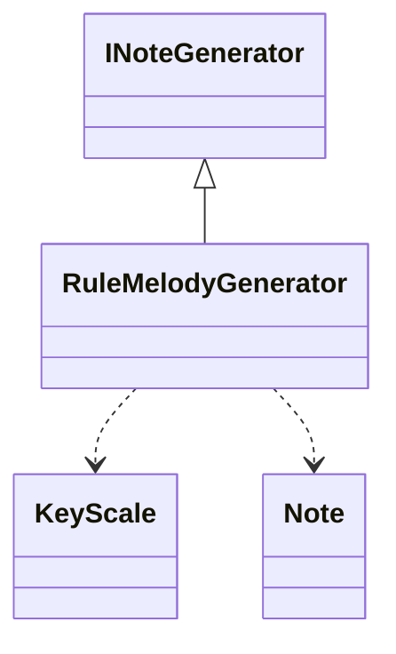

## 🕵️‍♂️ **Project Inspector**

> *Analyze, visualize, and document Unity/C# projects with ease.*


---

### 📘 Overview

**Project Inspector** is a lightweight command-line tool that scans Unity or general C# projects and generates clean, navigable **documentation**.
It automatically extracts:

* 📂 Folder trees
* 🧱 Classes and interfaces
* 🔧 Methods and parameters
* 💬 XML doc comments (`///`)
* 🪄 Mermaid class diagrams
* 🧭 Global architecture overview

It’s perfect for:

* Understanding large Unity codebases
* Generating visual diagrams for documentation
* Building project overviews for AI agents or onboarding devs

---

## ⚡️ Features

✅ Generate **folder trees**
✅ Extract **class & method signatures**
✅ Parse **XML summaries**
✅ Output to **Markdown**, **HTML**, or **TXT**
✅ Produce **Mermaid UML class diagrams**
✅ Detect **dependencies and inheritance**
✅ Works directly on Unity **Assets/** folders

---

## 🧰 Installation


### 🌍 **Using `pipx` (recommended for CLI tools)**

```bash
pipx install .
```

or directly from GitHub:

```bash
pipx install git+https://github.com/schnock-art/project_inspector.git
```

---

### 🧩 **Using pip (global install)**

```bash
pip install .
```

---

### 💻 **From source (dev mode)**

```bash
uv pip install -e .
```

---

## 🚀 Usage

Once installed, run from anywhere:

```bash
project_inspector --help
```

Example output:

```
🕵️ Project Inspector — analyze & document Unity/C# projects

usage: project_inspector [options] <path>
```

---

### 📂 Generate a Folder Tree

```bash
project_inspector --tree ./Assets
```

### 🧱 Extract Classes and Methods

```bash
project_inspector --classes --methods ./Assets
```

### 💬 Include XML Summaries

```bash
project_inspector --classes --methods --summaries ./Assets
```

### 🪄 Generate Mermaid Diagrams

```bash
project_inspector --classes --methods --mermaid ./Assets
```

### 🧭 Combine All and Output to File

```bash
project_inspector --tree --classes --methods --mermaid -o docs.md ./Assets
```

---

## 📄 Example Output

````markdown
### RuleMelodyGenerator

**File:** `Assets/_Project/Audio/MusicGen/Generators/Note/RuleMelodyGenerator.cs`

**Inherits:** INoteGenerator

**Methods:**
- `List<Note> Generate(KeyScale scale, int length, Note minNote, Note maxNote, int seed)`
- `Note GenerateNext(KeyScale scale, Note previous, Note minNote, Note maxNote)`
- `int ClosestIndexSteps(List<int> pool, int currentMidi, int scaleSteps)`



---

## 🧠 Architecture

`project_inspector` consists of modular analyzers and writers:

```

project_inspector/
├── analyzers/
│   ├── cs_parser.py      # Extracts classes, methods, dependencies
│   └── folder_tree.py    # Generates a tree view of the project
├── writers/
│   ├── md_writer.py      # Markdown renderer
│   ├── mermaid_writer.py # Mermaid UML generator
│   └── html_writer.py    # Optional: pretty HTML output
└── cli.py                # Command-line entrypoint

````

---

## 🛠️ Development

### Setup virtual environment
```bash
uv venv
uv pip install -e .[dev]
````

### Run locally

```bash
uv run project_inspector --tree ./Assets
```

### Run tests

```bash
pytest
```

---

## 📜 License

MIT License © 2025 — Created by **<Your Name>**

---

## 💬 Contributing

PRs are welcome!
To contribute:

1. Fork this repo
2. Create a feature branch (`feature/your-idea`)
3. Add or improve analyzers or writers
4. Submit a pull request 🚀

---

## 🧩 Roadmap

* [ ] Dependency graph visualization
* [ ] AI-assisted code documentation summaries
* [ ] Python project analyzer
* [ ] VSCode extension

---

## 🧠 Inspiration

Born from the need to quickly **understand and visualize Unity projects** for generative music systems and procedural tools.

---

Would you like me to **customize it with your GitHub repo link + author name** so it’s publish-ready (and include the shield badges automatically pointing to your repo)?
