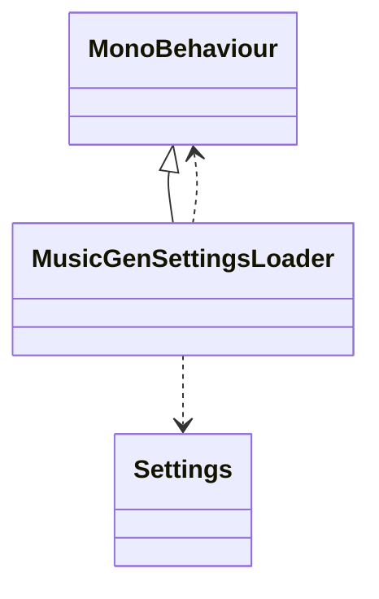
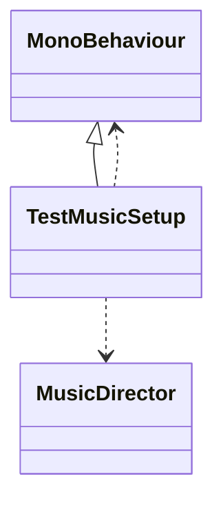
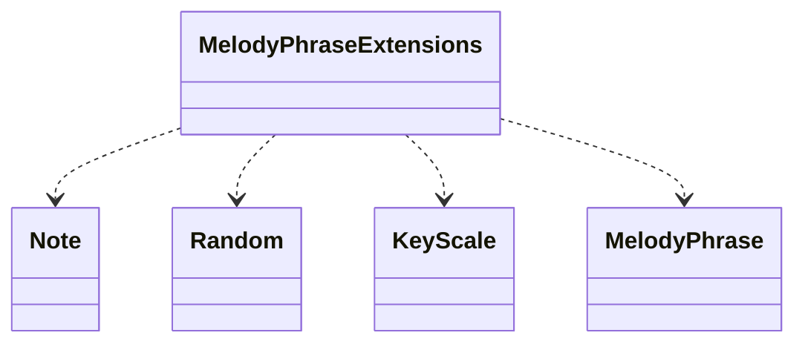
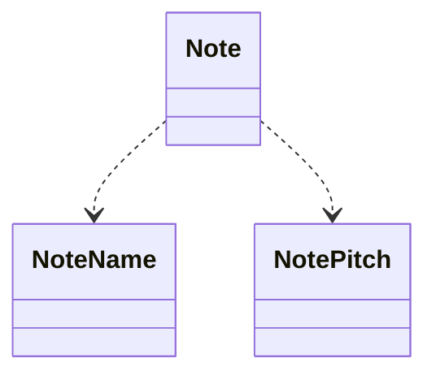

# ProjectDoc Output

Scanned folder: `C:\Users\jange\MusicGeneration\Assets\_Project\Audio`


### Composer: 
**File:** `C:\Users\jange\MusicGeneration\Assets\_Project\Audio\MusicGen\Composition\Composer.cs`

**Inherits:** MonoBehaviour

**Methods:**
- `None Composer()`
- `void Initialize(KeyScale startKey)`
- `void AddInstrument(IInstrumentTrack track)`
- `void RemoveInstrument(string name)`
- `IInstrumentTrack GetInstrument(string name)`
- `void ClearInstruments()`
- `bool SetInstrumentTargetKey(string instrumentName, KeyScale target)`
- `List<MusicalEvent> ComposeBars(int numBars, int beatsPerBar, float? tempoOverride)`

### IInstrumentTrack: 
**File:** `C:\Users\jange\MusicGeneration\Assets\_Project\Audio\MusicGen\Composition\Composer.cs`

**Methods:**
- `void SetCurrentKey(KeyScale key)`
- `void SetTargetKey(KeyScale key)`
- `List<MusicalEvent> ComposeBar(float secondsPerBeat, int beatsPerBar)`

### BaseInstrumentTrack: 
**File:** `C:\Users\jange\MusicGeneration\Assets\_Project\Audio\MusicGen\Composition\Composer.cs`

**Inherits:** IInstrumentTrack

**Methods:**
- `None BaseInstrumentTrack(string name, int channel, KeyScale startKey)`
- `void SetCurrentKey(KeyScale key)`
- `void SetTargetKey(KeyScale key)`
- `List<MusicalEvent> ComposeBar(float secondsPerBeat, int beatsPerBar)`
- `bool KeyEquals(KeyScale a, KeyScale b)`
```mermaid
classDiagram
MonoBehaviour <|-- Composer
Composer ..> List
Composer ..> List<MusicalEvent>
Composer ..> KeyScale
Composer ..> IInstrumentTrack>
Composer ..> MusicalEvent
Composer ..> MonoBehaviour
Composer ..> IReadOnlyCollection
Composer ..> IInstrumentTrack
Composer ..> IReadOnlyCollection<string>
IInstrumentTrack ..> List
IInstrumentTrack ..> List<MusicalEvent>
IInstrumentTrack ..> KeyScale
IInstrumentTrack ..> MusicalEvent
IInstrumentTrack <|-- BaseInstrumentTrack
BaseInstrumentTrack ..> List
BaseInstrumentTrack ..> List<MusicalEvent>
BaseInstrumentTrack ..> KeyScale
BaseInstrumentTrack ..> MusicalEvent
BaseInstrumentTrack ..> IInstrumentTrack
```


### HarmonyTrack: 
**File:** `C:\Users\jange\MusicGeneration\Assets\_Project\Audio\MusicGen\Composition\HarmonyTrack.cs`

**Inherits:** BaseInstrumentTrack

**Methods:**
- `None HarmonyTrack(string name, int channel, KeyScale startKey, ChordProgressionLibrary library, bool useArpeggios, int velocity)`
- `void SetCurrentKey(KeyScale key)`
- `void SetTargetKey(KeyScale key)`
- `List<MusicalEvent> ComposeBar(float secondsPerBeat, int beatsPerBar)`
- `new MusicalEvent()`
- `new MusicalEvent()`
```mermaid
classDiagram
BaseInstrumentTrack <|-- HarmonyTrack
HarmonyTrack ..> List
HarmonyTrack ..> List<MusicalEvent>
HarmonyTrack ..> KeyScale
HarmonyTrack ..> BaseInstrumentTrack
HarmonyTrack ..> HarmonyTimelineManager
HarmonyTrack ..> MusicalEvent
HarmonyTrack ..> List<Chord>
HarmonyTrack ..> Chord
HarmonyTrack ..> ChordProgressionLibrary
```


### MelodyTrack: 
**File:** `C:\Users\jange\MusicGeneration\Assets\_Project\Audio\MusicGen\Composition\MelodyTrack.cs`

**Inherits:** BaseInstrumentTrack

**Methods:**
- `None MelodyTrack(string name, int channel, KeyScale startKey, INoteGenerator noteGen, RhythmPhraseGenerator rhythmGen, int hitsPerBar, int velocity, float mutationProb, float mutationIntensity)`
- `new PatternEvolution()`
- `List<MusicalEvent> ComposeBar(float secondsPerBeat, int beatsPerBar)`
- `new MusicalEvent()`
```mermaid
classDiagram
BaseInstrumentTrack <|-- MelodyTrack
MelodyTrack ..> Note
MelodyTrack ..> List
MelodyTrack ..> List<MusicalEvent>
MelodyTrack ..> KeyScale
MelodyTrack ..> INoteGenerator
MelodyTrack ..> RhythmPhraseGenerator
MelodyTrack ..> BaseInstrumentTrack
MelodyTrack ..> MusicalEvent
MelodyTrack ..> PatternEvolution
```


### MusicDirector: 
**File:** `C:\Users\jange\MusicGeneration\Assets\_Project\Audio\MusicGen\Composition\MusicDirector.cs`

**Inherits:** MonoBehaviour

**Methods:**
- `void Awake()`
- `void StartMusic()`
- `void StopMusic()`
- `void SetTempo(float bpm)`
- `void ApplyKeyChangeToInstrument(string instrumentName, KeyScale targetKey, int transitionBars)`
- `void ApplyGlobalKeyChange(KeyScale targetKey, int transitionBars)`
```mermaid
classDiagram
MonoBehaviour <|-- MusicDirector
MusicDirector ..> List<string>
MusicDirector ..> List
MusicDirector ..> KeyScale
MusicDirector ..> Composer
MusicDirector ..> MusicTimelineQueue
MusicDirector ..> MonoBehaviour
```


### HarmonySegment: 
**File:** `C:\Users\jange\MusicGeneration\Assets\_Project\Audio\MusicGen\Harmony\HarmonySegment.cs`

**Methods:**
- `None HarmonySegment(KeyScale key, List<Chord> chords, int bars, bool isTransition)`
```mermaid
classDiagram
HarmonySegment ..> List
HarmonySegment ..> KeyScale
HarmonySegment ..> Chord
HarmonySegment ..> List<Chord>
```


### HarmonyTimelineManager: 
**File:** `C:\Users\jange\MusicGeneration\Assets\_Project\Audio\MusicGen\Harmony\HarmonyTimelineManager.cs`

**Methods:**
- `None HarmonyTimelineManager(ChordProgressionLibrary library, KeyScale start)`
- `new ChordProgressionLibrary()`
- `new KeyScale()`
- `void RequestTransition(KeyScale newTarget)`
- `new HarmonySegment()`
- `new HarmonySegment()`
- `List<Chord> GetNextChords(int maxBars)`
- `new HarmonySegment()`
```mermaid
classDiagram
HarmonyTimelineManager ..> HarmonySegment
HarmonyTimelineManager ..> List
HarmonyTimelineManager ..> KeyScale
HarmonyTimelineManager ..> List<Chord>
HarmonyTimelineManager ..> Chord
HarmonyTimelineManager ..> Queue
HarmonyTimelineManager ..> ChordProgressionLibrary
HarmonyTimelineManager ..> Queue<HarmonySegment>
```


### MusicTimelineQueueData: 
**File:** `C:\Users\jange\MusicGeneration\Assets\_Project\Audio\MusicGen\Playback\MusicTimelineQueue.cs`

**Methods:**
- `public Scheduled(MusicalEvent e, bool isNoteOff)`
- `float GetNextBarStart(int beatsPerBar)`
- `void AddBar(IEnumerable<MusicalEvent> newEvents, int beatsPerBar)`
- `new Scheduled()`
- `void RemovePlayed(float elapsedSec)`
- `float ComputeBeatsAhead()`
- `void UpdateTransportGrid(float currentBeat, int beatsPerBar)`

### Scheduled: 
**File:** `C:\Users\jange\MusicGeneration\Assets\_Project\Audio\MusicGen\Playback\MusicTimelineQueue.cs`

**Methods:**
- `None Scheduled(MusicalEvent e, bool isNoteOff)`

### MusicTimelineQueue: 
**File:** `C:\Users\jange\MusicGeneration\Assets\_Project\Audio\MusicGen\Playback\MusicTimelineQueue.cs`

**Inherits:** MonoBehaviour

**Methods:**
- `public Scheduled(MusicalEvent e, bool isNoteOff)`
- `float GetNextBarStart(int beatsPerBar)`
- `void AddBar(IEnumerable<MusicalEvent> newEvents, int beatsPerBar)`
- `new Scheduled()`
- `void RemovePlayed(float elapsedSec)`
- `float ComputeBeatsAhead()`
- `void UpdateTransportGrid(float currentBeat, int beatsPerBar)`
```mermaid
classDiagram
MusicTimelineQueueData ..> Scheduled
MusicTimelineQueueData ..> List<Scheduled>
MusicTimelineQueueData ..> IEnumerable
MusicTimelineQueueData ..> IEnumerable<MusicalEvent>
MusicTimelineQueueData ..> List
MusicTimelineQueueData ..> MusicalEvent
Scheduled ..> MusicalEvent
MonoBehaviour <|-- MusicTimelineQueue
MusicTimelineQueue ..> Scheduled
MusicTimelineQueue ..> List<Scheduled>
MusicTimelineQueue ..> IEnumerable
MusicTimelineQueue ..> IEnumerable<MusicalEvent>
MusicTimelineQueue ..> List
MusicTimelineQueue ..> MusicalEvent
MusicTimelineQueue ..> MonoBehaviour
```


### BiomeMusicSettings: 
**File:** `C:\Users\jange\MusicGeneration\Assets\_Project\Audio\MusicGen\Settings\BiomeMusicSettings.cs`

**Inherits:** ScriptableObject

**Methods:**
- `EmotionMapping GetEmotionMapping(string emotion)`
- `ScaleProfile GetRandomScale()`

### InstrumentPreset: 
**File:** `C:\Users\jange\MusicGeneration\Assets\_Project\Audio\MusicGen\Settings\BiomeMusicSettings.cs`

**Methods:**

### ScaleProfile: 
**File:** `C:\Users\jange\MusicGeneration\Assets\_Project\Audio\MusicGen\Settings\BiomeMusicSettings.cs`

**Methods:**

### EmotionMapping: 
**File:** `C:\Users\jange\MusicGeneration\Assets\_Project\Audio\MusicGen\Settings\BiomeMusicSettings.cs`

**Methods:**

### MelodyPaceMapping: 
**File:** `C:\Users\jange\MusicGeneration\Assets\_Project\Audio\MusicGen\Settings\BiomeMusicSettings.cs`

**Methods:**
```mermaid
classDiagram
ScriptableObject <|-- BiomeMusicSettings
BiomeMusicSettings ..> List
BiomeMusicSettings ..> InstrumentPreset
BiomeMusicSettings ..> List<ScaleProfile>
BiomeMusicSettings ..> ScriptableObject
BiomeMusicSettings ..> EmotionMapping
BiomeMusicSettings ..> List<EmotionMapping>
BiomeMusicSettings ..> MelodyPaceMapping
BiomeMusicSettings ..> ScaleProfile
ScaleProfile ..> ScaleType
EmotionMapping ..> ScaleType
```


### MusicGenSettings: 
**File:** `C:\Users\jange\MusicGeneration\Assets\_Project\Audio\MusicGen\Settings\MusicGenSettings.cs`

**Inherits:** ScriptableObject

**Methods:**
- `void OnEnable()`
- `void OnValidate()`
- `void SubscribeToTempoChange(Action<float> listener)`
- `void Apply()`
- `void SetTempo(float newTempo)`
```mermaid
classDiagram
ScriptableObject <|-- MusicGenSettings
MusicGenSettings ..> Action
MusicGenSettings ..> Action<float>
MusicGenSettings ..> ScriptableObject
```


### MusicGenSettingsLoader: 
**File:** `C:\Users\jange\MusicGeneration\Assets\_Project\Audio\MusicGen\Settings\MusicGenSettingsLoader.cs`

**Inherits:** MonoBehaviour

**Methods:**
- `void Awake()`
- `Settings loaded()`
- `void SetTempo(float newTempo)`



### TestMusicSetup: 
**File:** `C:\Users\jange\MusicGeneration\Assets\_Project\Audio\MusicGen\Test\TestMusicSetup.cs`

**Inherits:** MonoBehaviour

**Methods:**
- `void Awake()`
- `void Play()`
- `void Update()`



### Chord: 
**File:** `C:\Users\jange\MusicGeneration\Assets\_Project\Audio\MusicGen\Core\Chords\Chord.cs`

**Methods:**
- `None Chord(Note root, ChordType type, int scaleDegree)`
- `void BuildNotes()`
- `new Note()`
- `Chord GetInversion(int inversion)`
- `new Note()`
- `Chord AddExtension(int semitone)`
- `List<Note> GetArpeggio(ArpeggioStyle style, int octaves)`
- `new Note()`
- `string ToString()`
```mermaid
classDiagram
Chord ..> Note
Chord ..> List
Chord ..> ChordType
Chord ..> List<Note>
Chord ..> ArpeggioStyle
```

```mermaid
classDiagram
```


### MusicalEvent: 
**File:** `C:\Users\jange\MusicGeneration\Assets\_Project\Audio\MusicGen\Core\Events\MusicalEvent.cs`

**Methods:**
- `None MusicalEvent(float startBeat, float durationBeats, int velocity, int channel, int? program)`
- `string ToString()`
```mermaid
classDiagram
```


### MelodyPhrase: 
**File:** `C:\Users\jange\MusicGeneration\Assets\_Project\Audio\MusicGen\Core\Melody\MelodyPhrase.cs`

**Methods:**
- `None MelodyPhrase()`
- `None MelodyPhrase(IEnumerable<Note> notes)`
- `MelodyPhrase Clone()`
- `new Note()`
- `string ToString()`
```mermaid
classDiagram
MelodyPhrase ..> IEnumerable
MelodyPhrase ..> List
MelodyPhrase ..> Note
MelodyPhrase ..> IEnumerable<Note>
MelodyPhrase ..> List<Note>
```


### MelodyPhraseExtensions: 
**File:** `C:\Users\jange\MusicGeneration\Assets\_Project\Audio\MusicGen\Core\Melody\MelodyPhraseExtensions.Basic.cs`

**Methods:**
- `MelodyPhrase Transpose(this MelodyPhrase, int semitones)`
- `MelodyPhrase SwapAdjacent(this MelodyPhrase, float probability)`
- `MelodyPhrase InvertAround(this MelodyPhrase, Note axis)`
- `MelodyPhrase ConstrainToScale(this MelodyPhrase, KeyScale scale, int min, int max)`
- `void InsertNote(this MelodyPhrase, int index, Note note)`
- `new Note()`
- `void AddNote(this MelodyPhrase, Note note)`
- `new Note()`
- `void RemoveNoteAt(this MelodyPhrase, int index)`
- `bool RemoveRandomNote(this MelodyPhrase, Random rng)`
- `void RemoveNotes(this MelodyPhrase, int count, Random rng)`
- `void InsertNeighborNote(this MelodyPhrase, int index, KeyScale scale, int minStep, int maxStep, Random rng)`
- `void AddMultipleNotes(this MelodyPhrase, int count, KeyScale scale, Random rng)`
- `void InsertMusicalNote(this MelodyPhrase, KeyScale scale, Random rng)`
- `else if(< 0)`



### Note: 
**File:** `C:\Users\jange\MusicGeneration\Assets\_Project\Audio\MusicGen\Core\Notes\Note.cs`

**Methods:**
- `None Note(int midiNote)`
- `None Note(NoteName noteName, int octave)`
- `None Note(NotePitch pitch)`
- `string ToString()`



### NoteMap: 
**File:** `C:\Users\jange\MusicGeneration\Assets\_Project\Audio\MusicGen\Core\Notes\NoteMap.cs`

**Methods:**
- `None NoteMap()`
- `Note GetNote(int midiNote)`
```mermaid
classDiagram
NoteMap ..> Note
NoteMap ..> Note>
```

```mermaid
classDiagram
```

```mermaid
classDiagram
```


### NoteUtilities: 
**File:** `C:\Users\jange\MusicGeneration\Assets\_Project\Audio\MusicGen\Core\Notes\NoteUtilities.cs`

**Methods:**
- `float MidiToFrequency(int midiNote)`
- `int FrequencyToMidi(float frequency)`
- `Note Transpose(Note note, int semitones)`
- `new Note()`
- `int Interval(Note a, Note b)`
- `string GetNoteNameFromMidi(int midiNote)`
- `List<string> RangeNames(int startMidi, int endMidi)`
```mermaid
classDiagram
NoteUtilities ..> Note
NoteUtilities ..> List
NoteUtilities ..> List<string>
```


### RhythmPhrase: 
**File:** `C:\Users\jange\MusicGeneration\Assets\_Project\Audio\MusicGen\Core\Rythm\RhythmPhrase.cs`

**Methods:**
- `string ToString()`
- `RhythmPhrase Clone()`
- `new RhythmPhraseElement()`
- `IEnumerable<RhythmPhraseElement> LongestElements()`
- `IEnumerable<RhythmPhraseElement> ShortestElements()`
```mermaid
classDiagram
RhythmPhrase ..> List<RhythmPhraseElement>
RhythmPhrase ..> IEnumerable
RhythmPhrase ..> List
RhythmPhrase ..> IEnumerable<RhythmPhraseElement>
RhythmPhrase ..> RhythmPhraseElement
```

```mermaid
classDiagram
```


### RhythmPhraseExtensions: 
**File:** `C:\Users\jange\MusicGeneration\Assets\_Project\Audio\MusicGen\Core\Rythm\RhythmPhraseExtensions.cs`

**Methods:**
- `void NormalizeToBeats(this RhythmPhrase, float targetBeats)`
```mermaid
classDiagram
```


### RhythmPhraseGenerator: 
**File:** `C:\Users\jange\MusicGeneration\Assets\_Project\Audio\MusicGen\Core\Rythm\RhythmPhraseGenerator.cs`

**Methods:**
- `RhythmPhrase GenerateSmart(int beatsPerBar, int numBars, int numHits, FillStrategy strategy, int seed, bool randomizeOrder)`
- `else ApplyStochasticAdjustment()`
- `new RhythmPhraseElement()`
- `RhythmPhrase GenerateSubdividedVariation(RhythmPhrase basePhrase, float intensity, int seed)`
- `new RhythmPhraseElement()`
- `List<float> InitializeDurations(int numHits, float target)`
- `void ApplyDeterministicCorrection(List<float> durations, float diff)`
- `void ApplyStochasticAdjustment(List<float> durations, float diff)`
- `float SnapToClosestMusicalValue(float val)`
- `float TryHalve(float dur)`
- `float TryDouble(float dur)`
```mermaid
classDiagram
RhythmPhraseGenerator ..> List
RhythmPhraseGenerator ..> RhythmPhrase
RhythmPhraseGenerator ..> List<float>
RhythmPhraseGenerator ..> FillStrategy
```


### KeyScale: 
**File:** `C:\Users\jange\MusicGeneration\Assets\_Project\Audio\MusicGen\Core\Scales\KeyScale.cs`

**Methods:**
- `None KeyScale(NoteName root, ScaleType scaleType)`
- `void BuildNotes()`
- `new Note()`
- `List<Note> GetNotes()`
- `Note GetTonic()`
- `new Note()`
- `Note GetNoteByDegreeOffset(Note from, int diatonicSteps, int midiMin, int midiMax)`
- `new Note()`
- `List<int> BuildDiatonicLadder(int midiMin, int midiMax)`
- `List<Chord> GetDiatonicChords(bool useSevenths)`
- `else if()`
- `else if()`
- `else if()`
- `new Chord()`
- `Chord GetChord(int degree, bool useSevenths)`
- `new Chord(new Note)`
- `string ToString()`
```mermaid
classDiagram
KeyScale ..> List
KeyScale ..> Note
KeyScale ..> ChordType
KeyScale ..> ScaleType
KeyScale ..> List<Note>
KeyScale ..> NoteName
KeyScale ..> Chord
KeyScale ..> List<Chord>
KeyScale ..> List<int>
```


### ScaleIntervals: 
**File:** `C:\Users\jange\MusicGeneration\Assets\_Project\Audio\MusicGen\Core\Scales\ScaleType.cs`

**Methods:**
```mermaid
classDiagram
```


### ScaleUtils: 
**File:** `C:\Users\jange\MusicGeneration\Assets\_Project\Audio\MusicGen\Core\Scales\ScaleUtils.cs`

**Methods:**
- `HashSet<int> PitchClasses(KeyScale ks)`
- `HashSet<int> PitchClassIntersection(KeyScale a, KeyScale b)`
- `List<int> NotesInRange(KeyScale ks, int midiMin, int midiMax)`
- `int NearestCommonTone(int sourceMidi, KeyScale src, KeyScale dst, int midiMin, int midiMax)`
- `return NearestScaleNote()`
- `int NearestScaleNote(int sourceMidi, KeyScale ks, int midiMin, int midiMax)`
- `bool ContainsPitchClass(this KeyScale, int pitchClass)`
```mermaid
classDiagram
ScaleUtils ..> HashSet<int>
ScaleUtils ..> List
ScaleUtils ..> KeyScale
ScaleUtils ..> HashSet
ScaleUtils ..> List<int>
```


### ChordProgressionGenerator: 
**File:** `C:\Users\jange\MusicGeneration\Assets\_Project\Audio\MusicGen\Generators\Chord\ChordProgressionGenerator.cs`

**Methods:**
- `List<Chord> Generate(KeyScale startKey, int numChords, int seed, KeyScale targetKey, float modulationBias)`
- `new KeyScale()`
- `void ResetState()`
- `List<Chord> GenerateGradualModulation(KeyScale currentKey, KeyScale targetKey, int numChords, float modulationBias)`
- `List<Chord> GenerateForceArrival(KeyScale fromKey, KeyScale toKey, int numChords, float modulationBias)`
- `Chord FindPivotChord(KeyScale a, KeyScale b)`
- `Chord PickNextChord(Chord current, List<Chord> pool, KeyScale currentKey, KeyScale targetKey, float modulationBias)`
- `Chord ApplyVariations(Chord chord)`
- `float BaseFunctionalScore(int from, int to)`
```mermaid
classDiagram
ChordProgressionGenerator ..> Chord
ChordProgressionGenerator ..> List
ChordProgressionGenerator ..> KeyScale
ChordProgressionGenerator ..> List<Chord>
```


### ChordProgressionLibrary: 
**File:** `C:\Users\jange\MusicGeneration\Assets\_Project\Audio\MusicGen\Generators\Chord\ChordProgressionLibrary.cs`

**Methods:**
- `None ChordProgressionLibrary()`
- `List<Chord> GetProgression(KeyScale key, int variant, bool useSevenths)`
- `List<Chord> GetTransition(KeyScale from, KeyScale to)`
```mermaid
classDiagram
ChordProgressionLibrary ..> List<int>>
ChordProgressionLibrary ..> List
ChordProgressionLibrary ..> KeyScale
ChordProgressionLibrary ..> List<Chord>
ChordProgressionLibrary ..> Chord
```


### INoteGenerator: 
**File:** `C:\Users\jange\MusicGeneration\Assets\_Project\Audio\MusicGen\Generators\Note\INoteGenerator.cs`

**Methods:**
- `List<Note> Generate(KeyScale scale, int length, Note minNote, Note maxNote, int seed)`
- `Note GenerateNext(KeyScale scale, Note previous, Note minNote, Note maxNote)`
```mermaid
classDiagram
INoteGenerator ..> List
INoteGenerator ..> List<Note>
INoteGenerator ..> Note
INoteGenerator ..> KeyScale
```


### MarkovMelodyGenerator: 
**File:** `C:\Users\jange\MusicGeneration\Assets\_Project\Audio\MusicGen\Generators\Note\MarkovMelodyGenerator.cs`

**Inherits:** INoteGenerator

**Methods:**
- `None MarkovMelodyGenerator(KeyScale scale)`
- `None MarkovMelodyGenerator()`
- `void Rebuild(KeyScale scale)`
- `void SetSigma(float newSigma)`
- `List<Note> Generate(KeyScale scale, int length, Note minNote, Note maxNote, int seed)`
- `new Note()`
- `Note GenerateNext(KeyScale scale, Note previous, Note minNote, Note maxNote)`
- `new Note()`
- `int SampleNext(int current, int prev, int midiMin, int midiMax)`
- `return GetFirst()`
- `void BuildMatrices()`
- `void InterpolateTo(KeyScale other, float alpha)`
- `None MarkovMelodyGenerator()`
- `else for(int j, < 128)`
```mermaid
classDiagram
INoteGenerator <|-- MarkovMelodyGenerator
MarkovMelodyGenerator ..> List
MarkovMelodyGenerator ..> Note
MarkovMelodyGenerator ..> KeyScale
MarkovMelodyGenerator ..> INoteGenerator
MarkovMelodyGenerator ..> List<Note>
```


### RuleMelodyGenerator: 
**File:** `C:\Users\jange\MusicGeneration\Assets\_Project\Audio\MusicGen\Generators\Note\RuleMelodyGenerator.cs`

**Inherits:** INoteGenerator

**Methods:**
- `List<Note> Generate(KeyScale scale, int length, Note minNote, Note maxNote, int seed)`
- `new Note()`
- `new Note()`
- `new Note()`
- `Note GenerateNext(KeyScale scale, Note previous, Note minNote, Note maxNote)`
- `new Note(?? midiMin)`
- `new Note()`
- `new Note()`
- `new Note()`
- `int ClosestIndexSteps(List<int> pool, int currentMidi, int scaleSteps)`
```mermaid
classDiagram
INoteGenerator <|-- RuleMelodyGenerator
RuleMelodyGenerator ..> List
RuleMelodyGenerator ..> Note
RuleMelodyGenerator ..> KeyScale
RuleMelodyGenerator ..> INoteGenerator
RuleMelodyGenerator ..> List<Note>
RuleMelodyGenerator ..> List<int>
```


### PatternEvolution: 
**File:** `C:\Users\jange\MusicGeneration\Assets\_Project\Audio\MusicGen\Generators\Pattern\PatternEvolution.cs`

**Methods:**
- `None PatternEvolution(INoteGenerator noteGen, RhythmPhraseGenerator rhythmGen)`
- `void Initialize(KeyScale key, int bars, int beatsPerBar, int melodyHits, int melodyOctaves)`
- `void Mutate(KeyScale key, int bars, int beatsPerBar, int melodyHits)`
- `RhythmPhrase MutateRhythm(RhythmPhrase basePhrase)`
- `new RhythmPhraseElement()`
- `new RhythmPhraseElement()`
- `else if(< 0, > 1)`
- `MelodyPhrase MutateMelody(MelodyPhrase baseMelody, KeyScale key)`
- `else if(< 0)`
```mermaid
classDiagram
PatternEvolution ..> MelodyPhrase
PatternEvolution ..> Note
PatternEvolution ..> KeyScale
PatternEvolution ..> INoteGenerator
PatternEvolution ..> RhythmPhraseGenerator
PatternEvolution ..> RhythmPhrase
```


### MusicTimelineQueueEditor: 
**File:** `C:\Users\jange\MusicGeneration\Assets\_Project\Audio\MusicGen\Playback\Editor\MusicTimelineQueueEditor.cs`

**Inherits:** Editor

**Methods:**
- `void OnInspectorGUI()`
```mermaid
classDiagram
Editor <|-- MusicTimelineQueueEditor
```


## Global Architecture Diagram
```mermaid
classDiagram
BaseInstrumentTrack --> IInstrumentTrack
BaseInstrumentTrack --> KeyScale
BaseInstrumentTrack --> MusicalEvent
BaseInstrumentTrack <|-- HarmonyTrack
BaseInstrumentTrack <|-- MelodyTrack
BiomeMusicSettings --> EmotionMapping
BiomeMusicSettings --> InstrumentPreset
BiomeMusicSettings --> MelodyPaceMapping
BiomeMusicSettings --> ScaleProfile
Chord --> Note
ChordProgressionGenerator --> Chord
ChordProgressionGenerator --> KeyScale
ChordProgressionLibrary --> Chord
ChordProgressionLibrary --> KeyScale
Composer --> IInstrumentTrack
Composer --> KeyScale
Composer --> MusicalEvent
HarmonySegment --> Chord
HarmonySegment --> KeyScale
HarmonyTimelineManager --> Chord
HarmonyTimelineManager --> ChordProgressionLibrary
HarmonyTimelineManager --> HarmonySegment
HarmonyTimelineManager --> KeyScale
HarmonyTrack --> BaseInstrumentTrack
HarmonyTrack --> Chord
HarmonyTrack --> ChordProgressionLibrary
HarmonyTrack --> HarmonyTimelineManager
HarmonyTrack --> KeyScale
HarmonyTrack --> MusicalEvent
IInstrumentTrack --> KeyScale
IInstrumentTrack --> MusicalEvent
IInstrumentTrack <|-- BaseInstrumentTrack
INoteGenerator --> KeyScale
INoteGenerator --> Note
INoteGenerator <|-- MarkovMelodyGenerator
INoteGenerator <|-- RuleMelodyGenerator
KeyScale --> Chord
KeyScale --> Note
MarkovMelodyGenerator --> INoteGenerator
MarkovMelodyGenerator --> KeyScale
MarkovMelodyGenerator --> Note
MelodyPhrase --> Note
MelodyPhraseExtensions --> KeyScale
MelodyPhraseExtensions --> MelodyPhrase
MelodyPhraseExtensions --> Note
MelodyTrack --> BaseInstrumentTrack
MelodyTrack --> INoteGenerator
MelodyTrack --> KeyScale
MelodyTrack --> MusicalEvent
MelodyTrack --> Note
MelodyTrack --> PatternEvolution
MelodyTrack --> RhythmPhraseGenerator
MusicDirector --> Composer
MusicDirector --> KeyScale
MusicDirector --> MusicTimelineQueue
MusicTimelineQueue --> MusicalEvent
MusicTimelineQueue --> Scheduled
MusicTimelineQueueData --> MusicalEvent
MusicTimelineQueueData --> Scheduled
NoteMap --> Note
NoteUtilities --> Note
PatternEvolution --> INoteGenerator
PatternEvolution --> KeyScale
PatternEvolution --> MelodyPhrase
PatternEvolution --> Note
PatternEvolution --> RhythmPhrase
PatternEvolution --> RhythmPhraseGenerator
RhythmPhraseGenerator --> RhythmPhrase
RuleMelodyGenerator --> INoteGenerator
RuleMelodyGenerator --> KeyScale
RuleMelodyGenerator --> Note
ScaleUtils --> KeyScale
Scheduled --> MusicalEvent
TestMusicSetup --> MusicDirector
