# ProjectDoc Output

Scanned folder: `C:\Users\jange\MusicGeneration\Assets\_Project`

📂 **Project Tree: _Project**

```
_Project
├── Audio
│   ├── Biomes
│   ├── MusicGen
│   │   ├── Composition
│   │   │   ├── Composer.cs
│   │   │   ├── Composer.cs.meta
│   │   │   ├── HarmonyTrack.cs
│   │   │   ├── HarmonyTrack.cs.meta
│   │   │   ├── MelodyTrack.cs
│   │   │   ├── MelodyTrack.cs.meta
│   │   │   ├── MusicDirector.cs
│   │   │   └── MusicDirector.cs.meta
│   │   ├── Core
│   │   │   ├── Chords
│   │   │   │   ├── Chord.cs
│   │   │   │   ├── Chord.cs.meta
│   │   │   │   ├── ChordType.cs
│   │   │   │   └── ChordType.cs.meta
│   │   │   ├── Events
│   │   │   │   ├── MusicalEvent.cs
│   │   │   │   └── MusicalEvent.cs.meta
│   │   │   ├── Melody
│   │   │   │   ├── MelodyPhrase.cs
│   │   │   │   ├── MelodyPhrase.cs.meta
│   │   │   │   ├── MelodyPhraseExtensions.Basic.cs
│   │   │   │   └── MelodyPhraseExtensions.Basic.cs.meta
│   │   │   ├── Notes
│   │   │   │   ├── Note.cs
│   │   │   │   ├── Note.cs.meta
│   │   │   │   ├── NoteMap.cs
│   │   │   │   ├── NoteMap.cs.meta
│   │   │   │   ├── NoteName.cs
│   │   │   │   ├── NoteName.cs.meta
│   │   │   │   ├── NotePitch.cs
│   │   │   │   ├── NotePitch.cs.meta
│   │   │   │   ├── NoteUtilities.cs
│   │   │   │   └── NoteUtilities.cs.meta
│   │   │   ├── Rythm
│   │   │   │   ├── RhythmPhrase.cs
│   │   │   │   ├── RhythmPhrase.cs.meta
│   │   │   │   ├── RhythmPhraseElement.cs
│   │   │   │   ├── RhythmPhraseElement.cs.meta
│   │   │   │   ├── RhythmPhraseExtensions.cs
│   │   │   │   ├── RhythmPhraseExtensions.cs.meta
│   │   │   │   ├── RhythmPhraseGenerator.cs
│   │   │   │   └── RhythmPhraseGenerator.cs.meta
│   │   │   ├── Scales
│   │   │   │   ├── KeyScale.cs
│   │   │   │   ├── KeyScale.cs.meta
│   │   │   │   ├── ScaleType.cs
│   │   │   │   ├── ScaleType.cs.meta
│   │   │   │   ├── ScaleUtils.cs
│   │   │   │   └── ScaleUtils.cs.meta
│   │   │   ├── Chords.meta
│   │   │   ├── Events.meta
│   │   │   ├── Melody.meta
│   │   │   ├── Notes.meta
│   │   │   ├── Rythm.meta
│   │   │   └── Scales.meta
│   │   ├── Generators
│   │   │   ├── Chord
│   │   │   │   ├── ChordProgressionGenerator.cs
│   │   │   │   ├── ChordProgressionGenerator.cs.meta
│   │   │   │   ├── ChordProgressionLibrary.cs
│   │   │   │   └── ChordProgressionLibrary.cs.meta
│   │   │   ├── Note
│   │   │   │   ├── INoteGenerator.cs
│   │   │   │   ├── INoteGenerator.cs.meta
│   │   │   │   ├── MarkovMelodyGenerator.cs
│   │   │   │   ├── MarkovMelodyGenerator.cs.meta
│   │   │   │   ├── RuleMelodyGenerator.cs
│   │   │   │   └── RuleMelodyGenerator.cs.meta
│   │   │   ├── Pattern
│   │   │   │   ├── PatternEvolution.cs
│   │   │   │   └── PatternEvolution.cs.meta
│   │   │   ├── Chord.meta
│   │   │   ├── Note.meta
│   │   │   └── Pattern.meta
│   │   ├── Harmony
│   │   │   ├── HarmonySegment.cs
│   │   │   ├── HarmonySegment.cs.meta
│   │   │   ├── HarmonyTimelineManager.cs
│   │   │   └── HarmonyTimelineManager.cs.meta
│   │   ├── Playback
│   │   │   ├── Editor
│   │   │   │   ├── MusicTimelineQueueEditor.cs
│   │   │   │   └── MusicTimelineQueueEditor.cs.meta
│   │   │   ├── Editor.meta
│   │   │   ├── MusicTimelineQueue.cs
│   │   │   └── MusicTimelineQueue.cs.meta
│   │   ├── Resources
│   │   │   ├── Forest.asset
│   │   │   ├── Forest.asset.meta
│   │   │   ├── MusicGenSettings.asset
│   │   │   └── MusicGenSettings.asset.meta
│   │   ├── Scenes
│   │   │   ├── TestScene.unity
│   │   │   └── TestScene.unity.meta
│   │   ├── Settings
│   │   │   ├── BiomeMusicSettings.cs
│   │   │   ├── BiomeMusicSettings.cs.meta
│   │   │   ├── MusicGenSettings.cs
│   │   │   ├── MusicGenSettings.cs.meta
│   │   │   ├── MusicGenSettingsLoader.cs
│   │   │   └── MusicGenSettingsLoader.cs.meta
│   │   ├── Test
│   │   │   ├── TestMusicSetup.cs
│   │   │   └── TestMusicSetup.cs.meta
│   │   ├── Composition.meta
│   │   ├── Core.meta
│   │   ├── Generators.meta
│   │   ├── Harmony.meta
│   │   ├── Playback.meta
│   │   ├── Resources.meta
│   │   ├── Scenes.meta
│   │   ├── Settings.meta
│   │   └── Test.meta
│   ├── Biomes.meta
│   └── MusicGen.meta
└── Audio.meta
```

### Composer: 
**File:** `C:\Users\jange\MusicGeneration\Assets\_Project\Audio\MusicGen\Composition\Composer.cs`

**Namespace:** `SymphonyOfBiomes.Audio.MusicGen.Composition`

**Inherits:** MonoBehaviour

**Methods:**
- `void Initialize(KeyScale startKey)`
- `void AddInstrument(IInstrumentTrack track)`
- `void RemoveInstrument(string name)`
- `IInstrumentTrack GetInstrument(string name)`
- `void ClearInstruments()`
- `bool SetInstrumentTargetKey(string instrumentName, KeyScale target)`
- `List<MusicalEvent> ComposeBars(int numBars, int beatsPerBar, float? tempoOverride)`
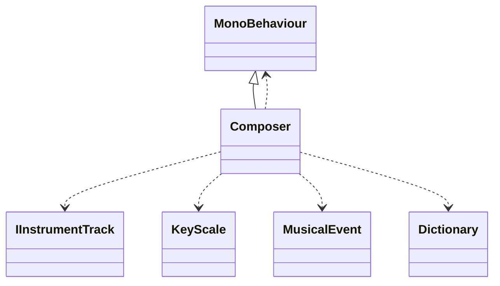


### IInstrumentTrack: 
**File:** `C:\Users\jange\MusicGeneration\Assets\_Project\Audio\MusicGen\Composition\Composer.cs`

**Namespace:** `SymphonyOfBiomes.Audio.MusicGen.Composition`

**Methods:**


### BaseInstrumentTrack: 
**File:** `C:\Users\jange\MusicGeneration\Assets\_Project\Audio\MusicGen\Composition\Composer.cs`

**Namespace:** `SymphonyOfBiomes.Audio.MusicGen.Composition`

**Inherits:** IInstrumentTrack

**Methods:**
- `bool KeyEquals(KeyScale a, KeyScale b)`
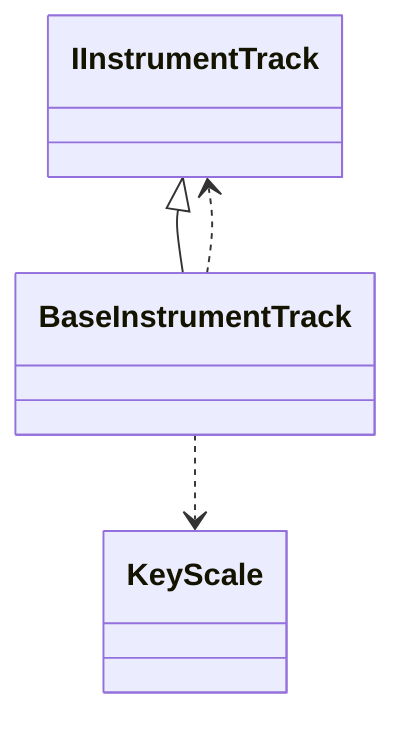


### HarmonyTrack: 
**File:** `C:\Users\jange\MusicGeneration\Assets\_Project\Audio\MusicGen\Composition\HarmonyTrack.cs`

**Namespace:** `SymphonyOfBiomes.Audio.MusicGen.Composition`

**Inherits:** BaseInstrumentTrack

**Methods:**
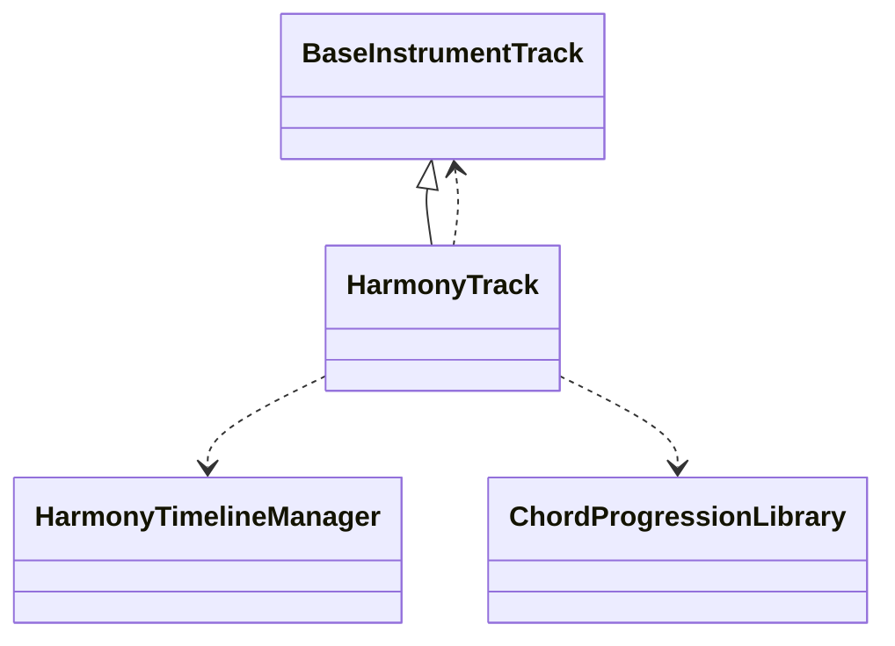


### MelodyTrack: 
**File:** `C:\Users\jange\MusicGeneration\Assets\_Project\Audio\MusicGen\Composition\MelodyTrack.cs`

**Namespace:** `SymphonyOfBiomes.Audio.MusicGen.Composition`

**Inherits:** BaseInstrumentTrack

**Methods:**
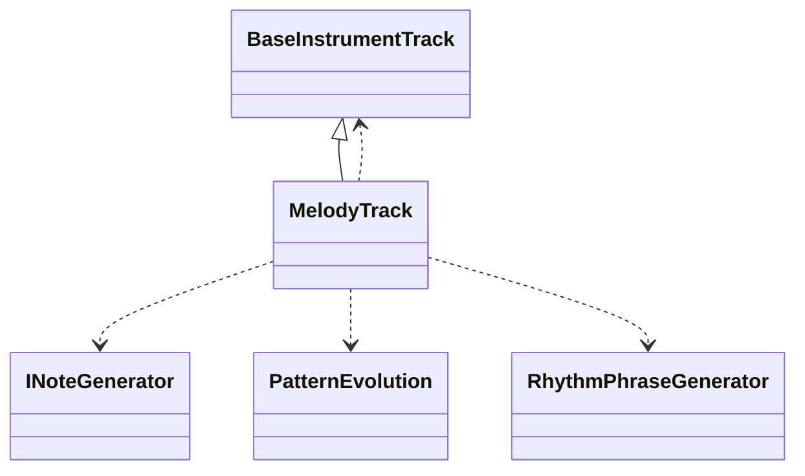


### MusicDirector: 
**File:** `C:\Users\jange\MusicGeneration\Assets\_Project\Audio\MusicGen\Composition\MusicDirector.cs`

**Namespace:** `SymphonyOfBiomes.Audio.MusicGen.Composition`

**Inherits:** MonoBehaviour

**Methods:**
- `void Awake()`
- `void StartMusic()`
- `void StopMusic()`
- `void SetTempo(float bpm)`
- `void ApplyKeyChangeToInstrument(string instrumentName, KeyScale targetKey, int transitionBars)`
- `void ApplyGlobalKeyChange(KeyScale targetKey, int transitionBars)`
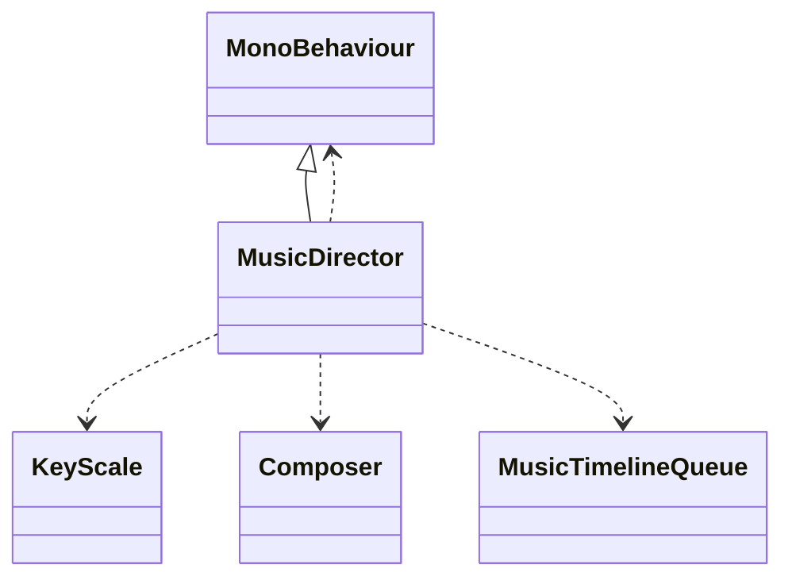


### HarmonySegment: 
**File:** `C:\Users\jange\MusicGeneration\Assets\_Project\Audio\MusicGen\Harmony\HarmonySegment.cs`

**Namespace:** `SymphonyOfBiomes.Audio.MusicGen.Harmony`

**Methods:**
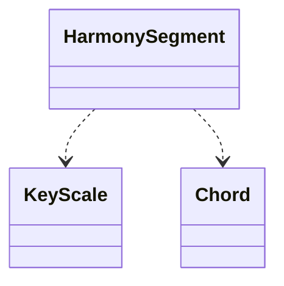


### HarmonyTimelineManager: 
**File:** `C:\Users\jange\MusicGeneration\Assets\_Project\Audio\MusicGen\Harmony\HarmonyTimelineManager.cs`

**Namespace:** `SymphonyOfBiomes.Audio.MusicGen.Harmony`

**Methods:**
- `void RequestTransition(KeyScale newTarget)`
- `List<Chord> GetNextChords(int maxBars)`
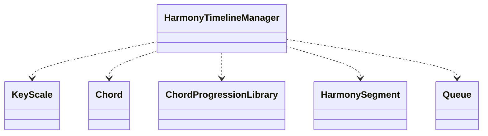


### MusicTimelineQueueData: 
**File:** `C:\Users\jange\MusicGeneration\Assets\_Project\Audio\MusicGen\Playback\MusicTimelineQueue.cs`

**Namespace:** `SymphonyOfBiomes.Audio.MusicGen.Playback`

**Methods:**
- `float GetNextBarStart(int beatsPerBar)`
- `void AddBar(IEnumerable<MusicalEvent> newEvents, int beatsPerBar)`
- `void RemovePlayed(float elapsedSec)`
- `float ComputeBeatsAhead()`
- `void UpdateTransportGrid(float currentBeat, int beatsPerBar)`
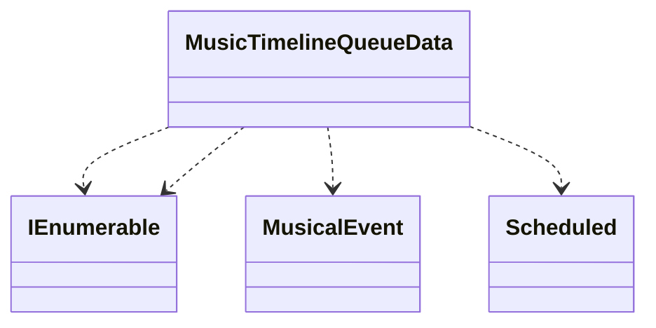


### Scheduled: 
**File:** `C:\Users\jange\MusicGeneration\Assets\_Project\Audio\MusicGen\Playback\MusicTimelineQueue.cs`

**Namespace:** `SymphonyOfBiomes.Audio.MusicGen.Playback`

**Methods:**
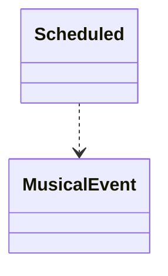


### MusicTimelineQueue: 
**File:** `C:\Users\jange\MusicGeneration\Assets\_Project\Audio\MusicGen\Playback\MusicTimelineQueue.cs`

**Namespace:** `SymphonyOfBiomes.Audio.MusicGen.Playback`

**Inherits:** MonoBehaviour

**Methods:**
- `float GetNextBarStart(int beatsPerBar)`
- `void AddBar(IEnumerable<MusicalEvent> newEvents, int beatsPerBar)`
- `void RemovePlayed(float elapsedSec)`
- `float ComputeBeatsAhead()`
- `void UpdateTransportGrid(float currentBeat, int beatsPerBar)`
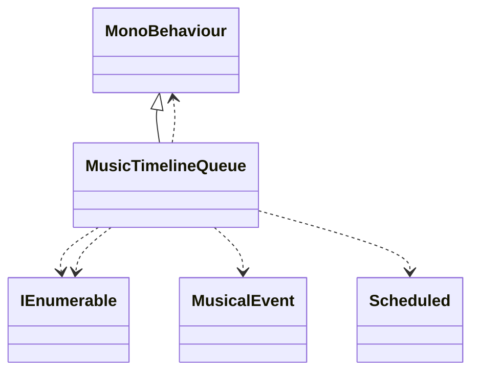


### BiomeMusicSettings: 
**File:** `C:\Users\jange\MusicGeneration\Assets\_Project\Audio\MusicGen\Settings\BiomeMusicSettings.cs`

**Namespace:** `SymphonyOfBiomes.Audio.MusicGen.Settings`

**Inherits:** ScriptableObject

**Methods:**
- `EmotionMapping GetEmotionMapping(string emotion)`
- `ScaleProfile GetRandomScale()`
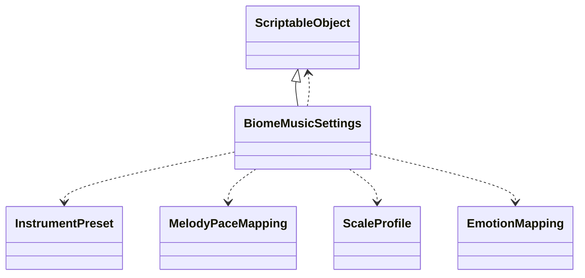


### InstrumentPreset: 
**File:** `C:\Users\jange\MusicGeneration\Assets\_Project\Audio\MusicGen\Settings\BiomeMusicSettings.cs`

**Namespace:** `SymphonyOfBiomes.Audio.MusicGen.Settings`

**Methods:**


### ScaleProfile: 
**File:** `C:\Users\jange\MusicGeneration\Assets\_Project\Audio\MusicGen\Settings\BiomeMusicSettings.cs`

**Namespace:** `SymphonyOfBiomes.Audio.MusicGen.Settings`

**Methods:**
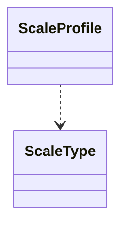


### EmotionMapping: 
**File:** `C:\Users\jange\MusicGeneration\Assets\_Project\Audio\MusicGen\Settings\BiomeMusicSettings.cs`

**Namespace:** `SymphonyOfBiomes.Audio.MusicGen.Settings`

**Methods:**
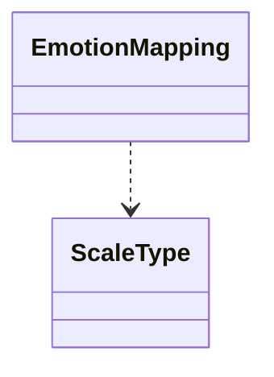


### MelodyPaceMapping: 
**File:** `C:\Users\jange\MusicGeneration\Assets\_Project\Audio\MusicGen\Settings\BiomeMusicSettings.cs`

**Namespace:** `SymphonyOfBiomes.Audio.MusicGen.Settings`

**Methods:**


### MusicGenSettings: 
**File:** `C:\Users\jange\MusicGeneration\Assets\_Project\Audio\MusicGen\Settings\MusicGenSettings.cs`

**Namespace:** `SymphonyOfBiomes.Audio.MusicGen.Settings`

**Inherits:** ScriptableObject

**Methods:**
- `void OnEnable()`
- `void OnValidate()`
- `void SubscribeToTempoChange(Action<float> listener)`
- `void Apply()`
- `void SetTempo(float newTempo)`
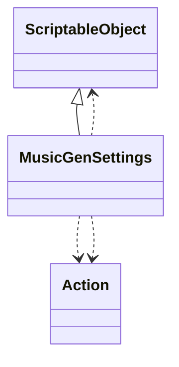


### MusicGenSettingsLoader: 
**File:** `C:\Users\jange\MusicGeneration\Assets\_Project\Audio\MusicGen\Settings\MusicGenSettingsLoader.cs`

**Namespace:** `SymphonyOfBiomes.Audio.MusicGen.Settings`

**Inherits:** MonoBehaviour

**Methods:**
- `void SetTempo(float newTempo)`
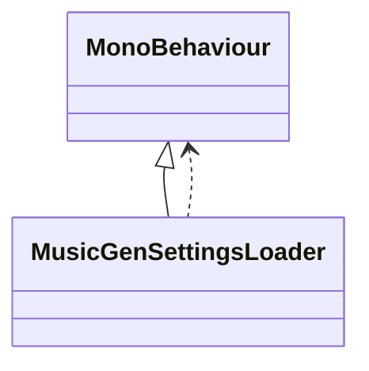


### TestMusicSetup: 
**File:** `C:\Users\jange\MusicGeneration\Assets\_Project\Audio\MusicGen\Test\TestMusicSetup.cs`

**Namespace:** `None`

**Inherits:** MonoBehaviour

**Methods:**
- `void Awake()`
- `void Play()`
- `void Update()`
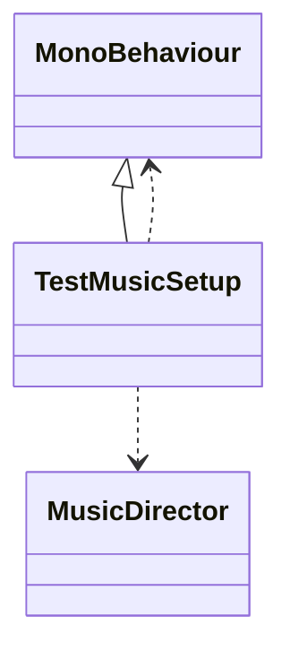


### Chord: 
**File:** `C:\Users\jange\MusicGeneration\Assets\_Project\Audio\MusicGen\Core\Chords\Chord.cs`

**Namespace:** `SymphonyOfBiomes.Audio.MusicGen.Core.Chords`

**Methods:**
- `void BuildNotes()`
- `Chord GetInversion(int inversion)`
- `Chord AddExtension(int semitone)`
- `List<Note> GetArpeggio(ArpeggioStyle style, int octaves)`
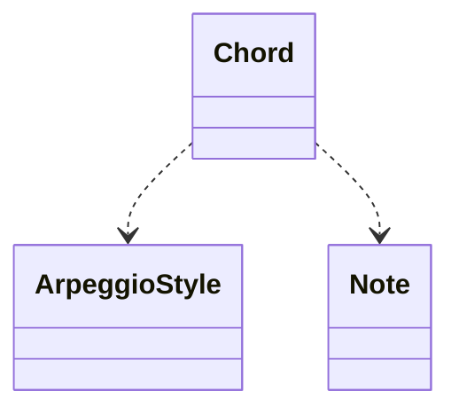


### MusicalEvent: 
**File:** `C:\Users\jange\MusicGeneration\Assets\_Project\Audio\MusicGen\Core\Events\MusicalEvent.cs`

**Namespace:** `SymphonyOfBiomes.Audio.MusicGen.Core.Events`

**Methods:**


### MelodyPhrase: 
**File:** `C:\Users\jange\MusicGeneration\Assets\_Project\Audio\MusicGen\Core\Melody\MelodyPhrase.cs`

**Namespace:** `SymphonyOfBiomes.Audio.MusicGen.Core.Melody`

**Methods:**
- `MelodyPhrase Clone()`
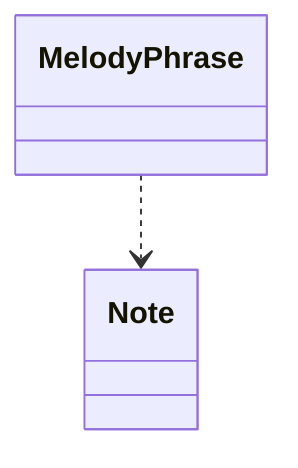


### MelodyPhraseExtensions: 
**File:** `C:\Users\jange\MusicGeneration\Assets\_Project\Audio\MusicGen\Core\Melody\MelodyPhraseExtensions.Basic.cs`

**Namespace:** `SymphonyOfBiomes.Audio.MusicGen.Core.Melody`

**Methods:**
- `MelodyPhrase Transpose(this MelodyPhrase, int semitones)`
- `MelodyPhrase SwapAdjacent(this MelodyPhrase, float probability)`
- `MelodyPhrase InvertAround(this MelodyPhrase, Note axis)`
- `MelodyPhrase ConstrainToScale(this MelodyPhrase, KeyScale scale, int min, int max)`
- `void InsertNote(this MelodyPhrase, int index, Note note)`
- `void AddNote(this MelodyPhrase, Note note)`
- `void RemoveNoteAt(this MelodyPhrase, int index)`
- `bool RemoveRandomNote(this MelodyPhrase, Random rng)`
- `void RemoveNotes(this MelodyPhrase, int count, Random rng)`
- `void InsertNeighborNote(this MelodyPhrase, int index, KeyScale scale, int minStep, int maxStep, Random rng)`
- `void AddMultipleNotes(this MelodyPhrase, int count, KeyScale scale, Random rng)`
- `void InsertMusicalNote(this MelodyPhrase, KeyScale scale, Random rng)`
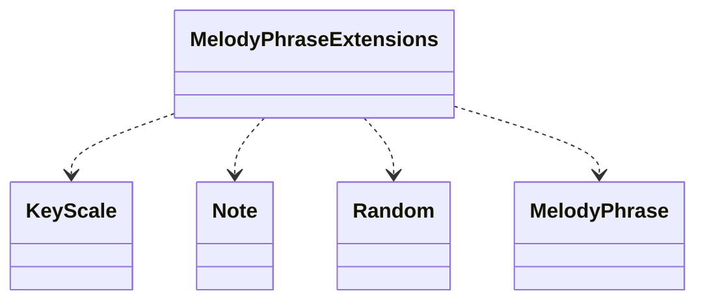


### Note: 
**File:** `C:\Users\jange\MusicGeneration\Assets\_Project\Audio\MusicGen\Core\Notes\Note.cs`

**Namespace:** `SymphonyOfBiomes.Audio.MusicGen.Core.Notes`

**Methods:**


### NoteMap: 
**File:** `C:\Users\jange\MusicGeneration\Assets\_Project\Audio\MusicGen\Core\Notes\NoteMap.cs`

**Namespace:** `SymphonyOfBiomes.Audio.MusicGen.Core.Notes`

**Methods:**
- `Note GetNote(int midiNote)`
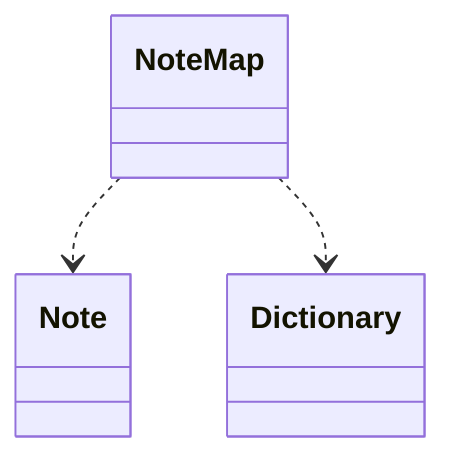


### NoteUtilities: 
**File:** `C:\Users\jange\MusicGeneration\Assets\_Project\Audio\MusicGen\Core\Notes\NoteUtilities.cs`

**Namespace:** `SymphonyOfBiomes.Audio.MusicGen.Core.Notes`

**Methods:**
- `float MidiToFrequency(int midiNote)`
- `int FrequencyToMidi(float frequency)`
- `Note Transpose(Note note, int semitones)`
- `int Interval(Note a, Note b)`
- `string GetNoteNameFromMidi(int midiNote)`
- `List<string> RangeNames(int startMidi, int endMidi)`
```mermaid
classDiagram
NoteUtilities ..> Note
```


### RhythmPhrase: 
**File:** `C:\Users\jange\MusicGeneration\Assets\_Project\Audio\MusicGen\Core\Rythm\RhythmPhrase.cs`

**Namespace:** `SymphonyOfBiomes.Audio.MusicGen.Core.Rhythm`

**Methods:**
- `RhythmPhrase Clone()`
- `IEnumerable<RhythmPhraseElement> LongestElements()`
- `IEnumerable<RhythmPhraseElement> ShortestElements()`
```mermaid
classDiagram
RhythmPhrase ..> IEnumerable
RhythmPhrase ..> IEnumerable
RhythmPhrase ..> RhythmPhraseElement
```


### RhythmPhraseExtensions: 
**File:** `C:\Users\jange\MusicGeneration\Assets\_Project\Audio\MusicGen\Core\Rythm\RhythmPhraseExtensions.cs`

**Namespace:** `SymphonyOfBiomes.Audio.MusicGen.Core.Rhythm`

**Methods:**
- `void NormalizeToBeats(this RhythmPhrase, float targetBeats)`


### RhythmPhraseGenerator: 
**File:** `C:\Users\jange\MusicGeneration\Assets\_Project\Audio\MusicGen\Core\Rythm\RhythmPhraseGenerator.cs`

**Namespace:** `SymphonyOfBiomes.Audio.MusicGen.Core.Rhythm`

**Methods:**
- `RhythmPhrase GenerateSmart(int beatsPerBar, int numBars, int numHits, FillStrategy strategy, int seed, bool randomizeOrder)`
- `RhythmPhrase GenerateSubdividedVariation(RhythmPhrase basePhrase, float intensity, int seed)`
- `List<float> InitializeDurations(int numHits, float target)`
- `void ApplyDeterministicCorrection(List<float> durations, float diff)`
- `void ApplyStochasticAdjustment(List<float> durations, float diff)`
- `float SnapToClosestMusicalValue(float val)`
- `float TryHalve(float dur)`
- `float TryDouble(float dur)`
```mermaid
classDiagram
RhythmPhraseGenerator ..> FillStrategy
RhythmPhraseGenerator ..> RhythmPhrase
```


### KeyScale: 
**File:** `C:\Users\jange\MusicGeneration\Assets\_Project\Audio\MusicGen\Core\Scales\KeyScale.cs`

**Namespace:** `SymphonyOfBiomes.Audio.MusicGen.Core.Scales`

**Methods:**
- `void BuildNotes()`
- `List<Note> GetNotes()`
- `Note GetTonic()`
- `Note GetNoteByDegreeOffset(Note from, int diatonicSteps, int midiMin, int midiMax)`
- `List<int> BuildDiatonicLadder(int midiMin, int midiMax)`
- `List<Chord> GetDiatonicChords(bool useSevenths)`
- `Chord GetChord(int degree, bool useSevenths)`
```mermaid
classDiagram
KeyScale ..> Chord
KeyScale ..> Note
```


### ScaleIntervals: 
**File:** `C:\Users\jange\MusicGeneration\Assets\_Project\Audio\MusicGen\Core\Scales\ScaleType.cs`

**Namespace:** `SymphonyOfBiomes.Audio.MusicGen.Core.Scales`

**Methods:**


### ScaleUtils: 
**File:** `C:\Users\jange\MusicGeneration\Assets\_Project\Audio\MusicGen\Core\Scales\ScaleUtils.cs`

**Namespace:** `SymphonyOfBiomes.Audio.MusicGen.Core.Scales`

**Methods:**
- `HashSet<int> PitchClasses(KeyScale ks)`
- `HashSet<int> PitchClassIntersection(KeyScale a, KeyScale b)`
- `List<int> NotesInRange(KeyScale ks, int midiMin, int midiMax)`
- `int NearestCommonTone(int sourceMidi, KeyScale src, KeyScale dst, int midiMin, int midiMax)`
- `int NearestScaleNote(int sourceMidi, KeyScale ks, int midiMin, int midiMax)`
- `bool ContainsPitchClass(this KeyScale, int pitchClass)`
```mermaid
classDiagram
ScaleUtils ..> HashSet
ScaleUtils ..> KeyScale
```


### ChordProgressionGenerator: 
**File:** `C:\Users\jange\MusicGeneration\Assets\_Project\Audio\MusicGen\Generators\Chord\ChordProgressionGenerator.cs`

**Namespace:** `SymphonyOfBiomes.Audio.MusicGen.Generators`

**Methods:**
- `List<Chord> Generate(KeyScale startKey, int numChords, int seed, KeyScale targetKey, float modulationBias)`
- `void ResetState()`
- `List<Chord> GenerateGradualModulation(KeyScale currentKey, KeyScale targetKey, int numChords, float modulationBias)`
- `List<Chord> GenerateForceArrival(KeyScale fromKey, KeyScale toKey, int numChords, float modulationBias)`
- `Chord FindPivotChord(KeyScale a, KeyScale b)`
- `Chord PickNextChord(Chord current, List<Chord> pool, KeyScale currentKey, KeyScale targetKey, float modulationBias)`
- `Chord ApplyVariations(Chord chord)`
- `float BaseFunctionalScore(int from, int to)`
```mermaid
classDiagram
ChordProgressionGenerator ..> KeyScale
ChordProgressionGenerator ..> Chord
```


### ChordProgressionLibrary: 
**File:** `C:\Users\jange\MusicGeneration\Assets\_Project\Audio\MusicGen\Generators\Chord\ChordProgressionLibrary.cs`

**Namespace:** `SymphonyOfBiomes.Audio.MusicGen.Generators`

**Methods:**
- `List<Chord> GetProgression(KeyScale key, int variant, bool useSevenths)`
- `List<Chord> GetTransition(KeyScale from, KeyScale to)`
```mermaid
classDiagram
ChordProgressionLibrary ..> Chord
ChordProgressionLibrary ..> KeyScale
```


### INoteGenerator: 
**File:** `C:\Users\jange\MusicGeneration\Assets\_Project\Audio\MusicGen\Generators\Note\INoteGenerator.cs`

**Namespace:** `SymphonyOfBiomes.Audio.MusicGen.Generators.NoteGen`

**Methods:**


### MarkovMelodyGenerator: 
**File:** `C:\Users\jange\MusicGeneration\Assets\_Project\Audio\MusicGen\Generators\Note\MarkovMelodyGenerator.cs`

**Namespace:** `SymphonyOfBiomes.Audio.MusicGen.Generators.NoteGen`

**Inherits:** INoteGenerator

**Methods:**
- `void Rebuild(KeyScale scale)`
- `void SetSigma(float newSigma)`
- `List<Note> Generate(KeyScale scale, int length, Note minNote, Note maxNote, int seed)`
- `Note GenerateNext(KeyScale scale, Note previous, Note minNote, Note maxNote)`
- `int SampleNext(int current, int prev, int midiMin, int midiMax)`
- `void BuildMatrices()`
- `void InterpolateTo(KeyScale other, float alpha)`
```mermaid
classDiagram
INoteGenerator <|-- MarkovMelodyGenerator
MarkovMelodyGenerator ..> INoteGenerator
MarkovMelodyGenerator ..> KeyScale
MarkovMelodyGenerator ..> Note
```


### RuleMelodyGenerator: 
**File:** `C:\Users\jange\MusicGeneration\Assets\_Project\Audio\MusicGen\Generators\Note\RuleMelodyGenerator.cs`

**Namespace:** `SymphonyOfBiomes.Audio.MusicGen.Generators.NoteGen`

**Inherits:** INoteGenerator

**Methods:**
- `List<Note> Generate(KeyScale scale, int length, Note minNote, Note maxNote, int seed)`
- `Note GenerateNext(KeyScale scale, Note previous, Note minNote, Note maxNote)`
- `int ClosestIndexSteps(List<int> pool, int currentMidi, int scaleSteps)`
```mermaid
classDiagram
INoteGenerator <|-- RuleMelodyGenerator
RuleMelodyGenerator ..> KeyScale
RuleMelodyGenerator ..> Note
RuleMelodyGenerator ..> INoteGenerator
```


### PatternEvolution: 
**File:** `C:\Users\jange\MusicGeneration\Assets\_Project\Audio\MusicGen\Generators\Pattern\PatternEvolution.cs`

**Namespace:** `SymphonyOfBiomes.Audio.MusicGen.Composition`

**Methods:**
- `void Initialize(KeyScale key, int bars, int beatsPerBar, int melodyHits, int melodyOctaves)`
- `void Mutate(KeyScale key, int bars, int beatsPerBar, int melodyHits)`
- `RhythmPhrase MutateRhythm(RhythmPhrase basePhrase)`
- `MelodyPhrase MutateMelody(MelodyPhrase baseMelody, KeyScale key)`
```mermaid
classDiagram
PatternEvolution ..> KeyScale
PatternEvolution ..> MelodyPhrase
PatternEvolution ..> RhythmPhrase
PatternEvolution ..> INoteGenerator
PatternEvolution ..> RhythmPhraseGenerator
```


### MusicTimelineQueueEditor: 
**File:** `C:\Users\jange\MusicGeneration\Assets\_Project\Audio\MusicGen\Playback\Editor\MusicTimelineQueueEditor.cs`

**Namespace:** `None`

**Inherits:** Editor

**Methods:**
```mermaid
classDiagram
Editor <|-- MusicTimelineQueueEditor
```


## Global Architecture Diagram
```mermaid
classDiagram
BaseInstrumentTrack --> IInstrumentTrack
BaseInstrumentTrack --> KeyScale
BaseInstrumentTrack <|-- HarmonyTrack
BaseInstrumentTrack <|-- MelodyTrack
BiomeMusicSettings --> EmotionMapping
BiomeMusicSettings --> InstrumentPreset
BiomeMusicSettings --> MelodyPaceMapping
BiomeMusicSettings --> ScaleProfile
Chord --> Note
ChordProgressionGenerator --> Chord
ChordProgressionGenerator --> KeyScale
ChordProgressionLibrary --> Chord
ChordProgressionLibrary --> KeyScale
Composer --> IInstrumentTrack
Composer --> KeyScale
Composer --> MusicalEvent
HarmonySegment --> Chord
HarmonySegment --> KeyScale
HarmonyTimelineManager --> Chord
HarmonyTimelineManager --> ChordProgressionLibrary
HarmonyTimelineManager --> HarmonySegment
HarmonyTimelineManager --> KeyScale
HarmonyTrack --> BaseInstrumentTrack
HarmonyTrack --> ChordProgressionLibrary
HarmonyTrack --> HarmonyTimelineManager
IInstrumentTrack <|-- BaseInstrumentTrack
INoteGenerator <|-- MarkovMelodyGenerator
INoteGenerator <|-- RuleMelodyGenerator
KeyScale --> Chord
KeyScale --> Note
MarkovMelodyGenerator --> INoteGenerator
MarkovMelodyGenerator --> KeyScale
MarkovMelodyGenerator --> Note
MelodyPhrase --> Note
MelodyPhraseExtensions --> KeyScale
MelodyPhraseExtensions --> MelodyPhrase
MelodyPhraseExtensions --> Note
MelodyTrack --> BaseInstrumentTrack
MelodyTrack --> INoteGenerator
MelodyTrack --> PatternEvolution
MelodyTrack --> RhythmPhraseGenerator
MusicDirector --> Composer
MusicDirector --> KeyScale
MusicDirector --> MusicTimelineQueue
MusicTimelineQueue --> MusicalEvent
MusicTimelineQueue --> Scheduled
MusicTimelineQueueData --> MusicalEvent
MusicTimelineQueueData --> Scheduled
NoteMap --> Note
NoteUtilities --> Note
PatternEvolution --> INoteGenerator
PatternEvolution --> KeyScale
PatternEvolution --> MelodyPhrase
PatternEvolution --> RhythmPhrase
PatternEvolution --> RhythmPhraseGenerator
RhythmPhraseGenerator --> RhythmPhrase
RuleMelodyGenerator --> INoteGenerator
RuleMelodyGenerator --> KeyScale
RuleMelodyGenerator --> Note
ScaleUtils --> KeyScale
Scheduled --> MusicalEvent
TestMusicSetup --> MusicDirector
